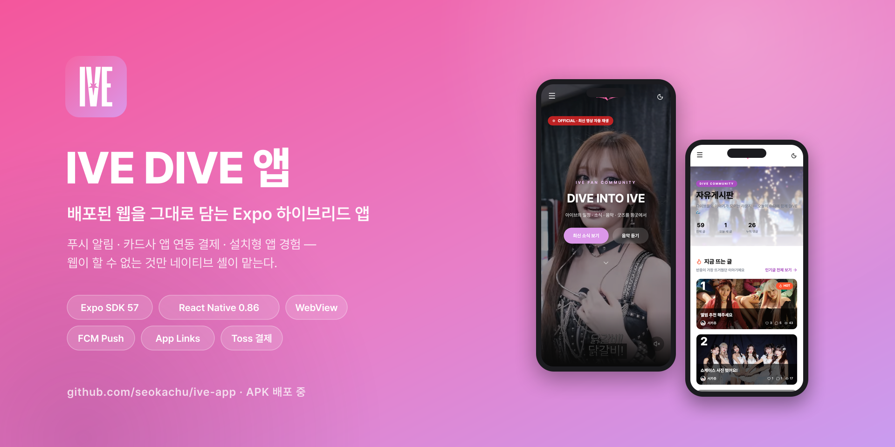

# IVE DIVE 하이브리드 앱

[IVE DIVE 웹 서비스](https://ive-three.vercel.app)([리포](https://github.com/seokachu/IVE))를
네이티브 셸로 감싼 **Expo(React Native) 하이브리드 앱**.
완성된 웹을 그대로 재사용하면서, 웹이 할 수 없는 것들 — **푸시 알림, 카드사 앱 연동
결제, 설치형 앱 경험** — 을 네이티브 레이어가 담당한다.


[](https://github.com/seokachu/ive-app/releases/latest/download/ive-dive.apk)

| 메인 (WebView) | 자유게시판 | 푸시 알림 |
|:---:|:---:|:---:|
|  |  |  |

## 앱 다운로드


Android 폰 카메라로 QR을 찍거나, 아래 링크로 받는다.

**[⬇ ive-dive.apk 다운로드](https://github.com/seokachu/ive-app/releases/latest/download/ive-dive.apk)**

- 배포된 웹을 담는 하이브리드 앱이라, 웹이 갱신되면 앱도 재설치 없이 함께 갱신된다
- 설치 시 "출처를 알 수 없는 앱" 허용이 필요하다 (스토어 외 배포)
- 링크는 항상 [최신 릴리즈](https://github.com/seokachu/ive-app/releases/latest)의 APK를 가리킨다

<br clear="right" />

## 기술 스택

- **Expo SDK 57 / React Native 0.86 / React 19.2** (웹과 React 버전 정렬)
- **react-native-webview** — WebView 셸 + 한국 PG 결제 대응
- **expo-notifications + FCM** — 푸시 알림 (Expo Push → FCM → 기기)
- **EAS** — 프로젝트/자격증명 관리, 로컬 Gradle 빌드로 개발

## 핵심 구현

### 1. 푸시 알림 (댓글·답글·좋아요)

```
[앱] 토큰 발급 → WebView 전역에 주입
[웹] 로그인 사용자와 연결해 Supabase에 저장 (RLS)
[서버] 댓글·좋아요 발생 시 수신자 계산 → Expo Push 발송
[앱] 수신 → 탭하면 해당 게시글로 이동 (콜드 스타트 대응)
```

- 수신자 로직: 글 작성자 + 대댓글 시 원댓글 작성자, 본인 제외, 중복 시 답글 알림 우선
- 내용 미리보기(40자), 마이페이지 수신 설정(on/off), 만료 토큰 자동 정리
- 같은 발송 서버가 **웹 브라우저(web-push)와 앱(Expo Push)** 두 채널을 처리한다 —
  `push_tokens.platform`으로 기기를 구분
- 상세 설계: [웹 리포 docs/push-notifications.md](https://github.com/seokachu/IVE/blob/main/docs/push-notifications.md)

### 2. 결제 (토스페이먼츠 + 카드사 앱)

- 결제창·카드사 인증·PG 중계 페이지를 전부 WebView 안에서 처리 (브라우저 이탈 차단)
- `intent://` 스킴 파싱으로 카드사 앱(SOL페이 등) 실행, 미설치 시 스토어 폴백
- Android App Links(`assetlinks.json`)로 외부 앱 복귀 시 브라우저가 아닌 앱으로
- 문제 해결 전 과정: [docs/webview-payment-debugging.md](docs/webview-payment-debugging.md)

### 3. 앱답게 만드는 UX

- **브랜드 스플래시** — 시스템 스플래시(그라데이션 톤)에서 이어지는 풀스크린 오버레이
  (그라데이션 + 로고 + IVE FAN COMMUNITY), 웹 첫 로딩이 끝나면 걷힌다
- **뒤로가기** — 웹 히스토리 우선, 첫 화면에서는 "한 번 더 누르면 종료" 토스트 후
  2초 내 재입력 시에만 종료 (실수 종료 방지)
- **다크 모드 셸 동기화** — 웹 테마가 바뀌면 상태바·세이프에어리어가 함께 바뀐다
- Android 당겨서 새로고침, 오프라인 감지 화면, iOS WebView 프로세스 종료 자동 복구
- 브랜드 아이콘 — 핑크→퍼플 그라데이션(#f465a5→#db97e9) + 흰 로고, 적응형/모노크롬 포함

## 문서

| 문서 | 내용 |
|---|---|
| [docs/decisions.md](docs/decisions.md) | 기술 의사결정 — 하이브리드 vs PWA, FCM 이유, 수신자 설계 등 |
| [docs/webview-payment-debugging.md](docs/webview-payment-debugging.md) | 결제 디버깅 기록 — 크롬 이탈, SameSite, originWhitelist |
| [웹 docs/push-notifications.md](https://github.com/seokachu/IVE/blob/main/docs/push-notifications.md) | 푸시 아키텍처 + 설계 결정 + 예상 Q&A |

## 실행

```bash
pnpm install
pnpm android   # 로컬 빌드 + 에뮬레이터/기기 실행 (Android Studio 필요)
pnpm start     # 개발 서버만
```

- 설치용 APK: `npx expo prebuild -p android` 후 `cd android && ./gradlew assembleRelease`
  → `android/app/build/outputs/apk/release/app-release.apk`
  (릴리즈 배포 시 `ive-dive.apk`로 이름을 바꿔 GitHub Releases에 올린다 — QR·뱃지가
  `releases/latest` 고정 링크를 쓰기 때문)
- `google-services.json`은 커밋하지 않음 — 재발급:
  ```bash
  pnpm dlx firebase-tools apps:sdkconfig ANDROID 1:836315136411:android:ab10379b7f4d837856613e \
    --project ive-dive-app -o google-services.json
  ```

## 데모 시나리오 (시연용)

1. **앱 실행** — 그라데이션 브랜드 스플래시 → 웹이 WebView로 로드
2. **푸시** — 다른 계정으로 웹에서 댓글 작성 → 몇 초 내 기기에 알림 도착
   → 탭하면 해당 게시글로 이동 (좋아요 알림도 동일)
3. **수신 설정** — 마이페이지 토글 OFF → 댓글 → 알림 없음 → ON 복구
4. **결제** — 굿즈샵 → 카드 결제 → 카드사 앱 인증 → 앱으로 복귀 → 성공 페이지
5. **뒤로가기** — 하드웨어 백 버튼이 웹 히스토리를 타고 이동, 첫 화면에서는 두 번 눌러 종료

## 남은 로드맵

- iOS 지원 (Apple Developer Program 필요 — APNs 설정)
- 알림 종류별 수신 설정 세분화
- 플레이스토어 배포 (EAS production 빌드, 릴리즈 서명 키로 assetlinks 갱신)
